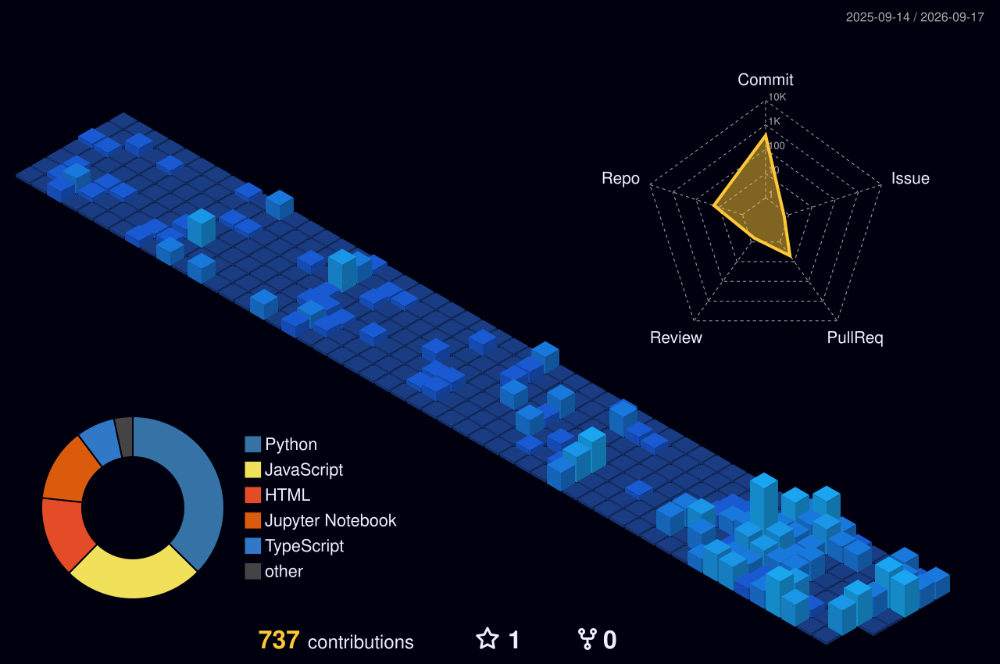

## About Me

- 🎓 BSc Computer Science @ **FAST-NUCES** (Class of 2027) — **3.67/4.00 CGPA**, **5x Dean's List**
- 🧠 Focused on **RAG pipelines**, **local open-source LLMs**, and applied AI in production
- ✍️ Write essays on Medium and Urdu poetry on the side
- 🔍 Interested in behavioral psychology
- 💬 Ask me about: vector databases, agentic architectures, WhatsApp bot infra

 

## Tech Stack

 

## Featured Engineering

### 🌾 FasaalAI
Trilingual WhatsApp bot. pgvector RAG pipeline. Live scraping.

### 🕸️ Aniporia
Microservices platform. Maps knowledge gaps. JWT REST APIs feeding 3D UI graphs.

### 🔗 Autonomous Backlink System — Gaper.io
Custom RAG pipeline. Generates 100+ links/hr.

 

## GitHub Analytics

 

## Connect

